  <strong>AI Infrastructure · Developer Tools · Open Source</strong>

  

<h1 align="center">极客小云 | XiaoYun</h1>

  AI 基础设施与开发者工具方向的独立开发者、开源贡献者。 
  专注把复杂问题拆解为可复现、可验证、可维护的工程实现。

  <strong>AI Infrastructure</strong> · <strong>Developer Tools</strong> · <strong>GPU Kernels</strong> · <strong>Security Engineering</strong>

  
  
  
  

  
  
  

  

---

## 技术定位

| 方向 | 技术关键词 |
| :--- | :--- |
| **AI Agent & Developer Tools** | MCP、CLI/SDK、spec-driven workflow、模型协议适配、上下文管理 |
| **AI Systems & GPU** | PyTorch、Triton、CUDA、动态 Shape、推理与训练 Pipeline、Kernel 正确性 |
| **Security & Reliability** | Shell 安全、路径穿越防护、Fallback、超时与中止传播、回归测试 |
| **Full-stack & Visualization** | Python、Go、TypeScript、React/Vite、PostgreSQL、Redis、WebGL、OKLCH |

## 个人简介

我主要使用 `Python`、`Go` 和 `TypeScript`，持续参与 AI Agent、GPU/编译器基础设施、安全工程和可视化产品的开发。工作方式偏工程化：从 Issue 复现和边界条件入手，完成实现、测试与文档闭环，再将成熟方案沉淀为可复用的项目或开源贡献。

## 开源贡献与项目亮点

> 以下内容根据 GitHub 公开提交与 Pull Request 整理，PR 状态截至 2026-09-14。

### 已合并的 Pull Requests

| 项目 | PR | 简介 |
| :--- | :--- | :--- |
| [unslothai/unsloth](https://github.com/unslothai/unsloth) | [#10790 Fix fp8 block dequant fallback on pre-sm89 GPUs](https://github.com/unslothai/unsloth/pull/10790) | 修复低于 `sm89` 架构的 GPU 执行 FP8 block dequant 时错误进入不支持的 Triton Kernel，恢复 PyTorch fallback |
| [unslothai/unsloth](https://github.com/unslothai/unsloth) | [#10797 Clear the metadata directory cache before scanning installed records](https://github.com/unslothai/unsloth/pull/10797) | 清理安装元数据目录缓存，使同一进程内新增或损坏的 `*.dist-info` 能被安装校验及时发现 |
| [fla-org/flash-linear-attention](https://github.com/fla-org/flash-linear-attention) | [#1111 Restore backend dispatch under `torch.compiler.disable`](https://github.com/fla-org/flash-linear-attention/pull/1111) | 修正装饰器顺序，避免 `torch.compiler.disable` 丢失 KDA backend dispatch |
| [Tencent/tdesign-common](https://github.com/Tencent/tdesign-common) | [#2639 fix(Button): 修复自定义 SVG 图标与文字的间距](https://github.com/Tencent/tdesign-common/pull/2639) | 为普通 SVG 图标补齐 Button 图标与文本之间的间距，并通过项目测试 |
| [superdoc/docx-editor](https://github.com/superdoc/docx-editor) | [#3616 fix(super-editor): support nested content controls](https://github.com/superdoc/docx-editor/pull/3616) | 修复 Word `w:sdt` 嵌套 content controls 的 DOCX 导入问题 |
| [superdoc/docx-editor](https://github.com/superdoc/docx-editor) | [#3641 fix(super-editor): rethrow export docx errors](https://github.com/superdoc/docx-editor/pull/3641) | `Editor.exportDocx()` 失败时正确把错误抛给调用方，并补充回归测试 |
| [stepfun-ai/Step-Realtime-CLI](https://github.com/stepfun-ai/Step-Realtime-CLI) | [#18 Fix smart compaction abort handling](https://github.com/stepfun-ai/Step-Realtime-CLI/pull/18) | 修复 smart compaction 中止处理，用户中断不再被误判为可恢复的压缩失败 |
| [insistence/RuoYi-Vue3-FastAPI](https://github.com/insistence/RuoYi-Vue3-FastAPI) | [#82 perf: 优化项目启动速度](https://github.com/insistence/RuoYi-Vue3-FastAPI/pull/82) | 启动连通性检查改用国内可达 DNS，路由扫描跳过 `.git`、`venv` 等目录 |

### 维护者采纳与发布成果

-  **[fix(approval): close three shell-obfuscation denylist bypasses](https://github.com/NousResearch/hermes-agent/pull/56184)** — [NousResearch/hermes-agent](https://github.com/NousResearch/hermes-agent)  
  我在 [#40663](https://github.com/NousResearch/hermes-agent/pull/40663) 中提出的 shell word 级变体扫描与去混淆方案（识别 `$(echo rm)` 这类绕过，同时避免误报参数里的 `rm`），被维护者整合进该综合修复，并标注 Class 1 credit 为 `@xy200303 (#40663)`。
-  **[fix(skills): block path traversal via skill_view name argument](https://github.com/NousResearch/hermes-agent/pull/40566)** — [NousResearch/hermes-agent](https://github.com/NousResearch/hermes-agent)  
  我在 [#40521](https://github.com/NousResearch/hermes-agent/pull/40521) 中报告并修复了 `skill_view` `name` 参数的路径穿越漏洞；维护者复用现有 traversal 辅助函数收紧后在 #40566 合并，并明确标注 "Salvaged from #40521 (@xy200303)"。
-  **[Compare View feature](https://github.com/CVHub520/X-AnyLabeling/releases/tag/v3.3.7)** — [CVHub520/X-AnyLabeling v3.3.7](https://github.com/CVHub520/X-AnyLabeling/releases/tag/v3.3.7)  
  多模态图像对比显示功能被纳入官方 Release，可用于红外/可见光融合、mask preview、超分等场景。
-  **[Clear existing lint warnings](https://github.com/stepfun-ai/Step-Realtime-CLI/pull/15)** — [stepfun-ai/Step-Realtime-CLI](https://github.com/stepfun-ai/Step-Realtime-CLI)  
  维护者确认该修复比官方落地的 [#10](https://github.com/stepfun-ai/Step-Realtime-CLI/pull/10) 早一个月，四个文件中两个与官方修复完全一致、两个仅差循环变量名，关闭时明确致谢并说明"并非 PR 本身有问题"。

### 近期 Pull Requests

-  **[TileLang #3205](https://github.com/tile-ai/tilelang/pull/3205)**、**[#3206](https://github.com/tile-ai/tilelang/pull/3206)**、**[#3207](https://github.com/tile-ai/tilelang/pull/3207)** — 修复 `T.clamp` 的 NaN 传播、CUDA Kernel 中 host-only assert，以及输出参数位于动态 shape 输入之前时的 JIT 分配错误。
-  **[Flash Linear Attention #1239](https://github.com/fla-org/flash-linear-attention/pull/1239)**、**[#1242](https://github.com/fla-org/flash-linear-attention/pull/1242)**、**[#1244](https://github.com/fla-org/flash-linear-attention/pull/1244)** — 修复 chunk-state Kernel 的 CUDA 网格上限问题，以及 KDA/GDN-2 `safe_gate` 对未来 token 的数值依赖。
-  **[FlashKDA #27](https://github.com/MoonshotAI/FlashKDA/pull/27)**、**[#28](https://github.com/MoonshotAI/FlashKDA/pull/28)** — 增加可微分 CPU KDA backend 与完整 CUDA 训练路径，覆盖前向、反向和研究验证场景。
-  **[Unsloth #10796](https://github.com/unslothai/unsloth/pull/10796)** — 为 GPU inference smoke test 的 Hub 下载增加超时边界，避免慢连接阻塞整个测试套件。
-  **[Kimi Code #2498](https://github.com/MoonshotAI/kimi-code/pull/2498)**、**[#2499](https://github.com/MoonshotAI/kimi-code/pull/2499)** — 修复不可达阈值导致的自动压缩循环，并为无工具进展的 goal continuation 增加退避策略。
-  **[ncnn #6844](https://github.com/Tencent/ncnn/pull/6844)**、**[#6845](https://github.com/Tencent/ncnn/pull/6845)** — 修复非整数缩放插值与 light mode 下外部 `Mat` 的处理问题，并补充回归测试。
-  **[Tencent Hunyuan Hy3 #53](https://github.com/Tencent-Hunyuan/Hy3/pull/53)**、**[#103](https://github.com/Tencent-Hunyuan/Hy3/pull/103)** — 提交数据分析 MCP Server 与混元多模型驱动的 ArchAgent 空间设计工作台。
-  **[ollama #16717](https://github.com/ollama/ollama/pull/16717)** — 保留多模态解析中的嵌套文件路径。

GitHub 公开搜索当前记录有 40 个开放 PR，覆盖 MoonshotAI、Tencent、NousResearch、Unsloth、TileLang、Flash Linear Attention 等项目。

### 高价值技术贡献

| 项目 / 成果 | 技术贡献 |
| :--- | :--- |
| [MoonshotAI/FlashKDA #28](https://github.com/MoonshotAI/FlashKDA/pull/28) | 独立使用 CUDA/CuTe 实现 KDA 完整训练路径，覆盖 gate cumsum、intra attention、WY recompute、chunk state、前向与反向 Kernel；提交涉及 39 个文件、约 8.9k 行实现。 |
| [fla-org/flash-linear-attention #1112](https://github.com/fla-org/flash-linear-attention/pull/1112) | 将 FlashKDA CUDA training backend 接入 `chunk_kda` 的 backend dispatch，打通底层 CUDA Kernel 到上层训练框架的可选集成路径。 |
| [kda-mla-stock](https://github.com/xy200303/kda-mla-stock) | 将 KDA/MLA 思路用于量化时间序列与股票预测实验，沉淀完整实验产物、结果分析，以及 Qlib 数据下载和本地数据包流程。 |

### 工作亮点

- **AI 基础设施与 GPU Kernel**：围绕 Flash Linear Attention、FlashKDA 和 TileLang，处理 CUDA 训练路径、Triton backend dispatch、动态 Shape、Kernel 代码生成和门控注意力数值正确性问题。
- **可靠性工程**：在 Unsloth、Kimi Code、Step-Realtime-CLI、ncnn 等项目中完善 Fallback、缓存失效、超时、中止传播、退避和回归测试，覆盖从异常处理到测试基础设施的完整链路。
- **安全工程**：针对 Shell 命令混淆、路径穿越、代理环境变量和外部输入边界等问题提交修复，关注安全策略的绕过面、误报率和可验证性。
- **产品化与可视化**：将 OKLCH 色彩计算、TDesign Design Token、MCP、3D/WebGL 和多模型能力落地为可运行的工具与产品原型。

### Issues

-  **[RootModel unions 反序列化问题反馈](https://github.com/langchain-ai/langchain/issues/38137)** — [langchain-ai/langchain](https://github.com/langchain-ai/langchain)
-  **[VS Code terminal input freezes when pasting escaped single-line JSON](https://github.com/openai/codex/issues/27405)** — [openai/codex](https://github.com/openai/codex)

### 代表项目与作品

| 项目 | 定位 | 技术关键词 |
| :--- | :--- | :--- |
| [拾色 · 东方](https://github.com/xy200303/shise-dongfang) | 537 色传统色主题馆，提供图片取色、配色实验室、Design Token 沙盒与 3D 展示 | React · TypeScript · OKLCH · WebGL · TDesign |
| [shise-engine](https://github.com/xy200303/shise-engine) | 感知均匀色阶与 TDesign Design Token 生成引擎 | TypeScript · OKLCH · npm |
| [ArchAgent](https://github.com/xy200303/ArchAgent) | 混元多模型驱动的对话式空间设计工作台，连接设计决策、3D 资产和场景导出 | Electron · React · TypeScript · Three.js |
| [Spec Kimi](https://github.com/xy200303/spec-kimi-code) | 将 Kimi Code CLI 扩展为可追踪的 spec-driven 开发工作流 | TypeScript · CLI · ACP |
| [AetherVectorLab/dev-mesh](https://github.com/AetherVectorLab/dev-mesh) | 为 AI 编程助手提供本地优先的项目知识层和 MCP 检索能力 | TypeScript · MCP · Automerge CRDT · JSONL · local-first |

### 其他开源项目

- [OpenTrans](https://github.com/xy200303/OpenTrans) ：多协议 LLM 请求体、响应体和流式事件转换 SDK。
- [AiCodeAudit](https://github.com/xy200303/AiCodeAudit) ：基于大模型的代码安全审计工具，支持 CLI 与 Streamlit Web 界面。
- [image_registration_tool](https://github.com/xy200303/image_registration_tool) ：红外图像与可见光图像的手动配准、批量处理工具。
- [ComfyUiApi](https://github.com/xy200303/ComfyUiApi) ：调用 ComfyUI API 的 Python 客户端库。
- [SafeGate](https://github.com/xy200303/SafeGate) ：可配置的 IP 风控网关与反向代理防火墙。
- [spec-coding-mcp](https://github.com/xy200303/spec-coding-mcp) ：为 Codex、Claude Code、OpenCode 等编程工具提供本地规格上下文。

## GitHub 总览

<table>
  <tr>
    <td width="42%" valign="top">
      
       
      
       
      
    </td>
    <td width="58%" valign="top">
      <picture>
        <source media="(prefers-color-scheme: dark)" srcset="./profile/activity-dark.svg" />
        <source media="(prefers-color-scheme: light)" srcset="./profile/activity.svg" />
        
      </picture>
    </td>
  </tr>
</table>

## 技术栈

  
<strong>展开查看技术分类</strong>

   

  **语言与运行时**

  
  
  
  
  
  
  

  **AI 与高性能计算**

  
  
  
  
  
  

  **前端与图形**

  
  
  
  
  
  

  **工程基础设施**

  
  
  
  
  
  
  

  **标记与兴趣**

  
  
  
  

## 更多信息

- 哔哩哔哩：[_极客小云_](https://space.bilibili.com/319065773?spm_id_from=333.1007.0.0)
- CSDN：[极客小云](https://blog.csdn.net/m0_73370855?type=blog)
- ORCID：[0009-0008-4777-304X](https://orcid.org/0009-0008-4777-304X)
- Docker Hub：[xy200303](https://hub.docker.com/u/xy200303)
- npm：[dev_xiaoyun](https://www.npmjs.com/~dev_xiaoyun)
- PyPI：[xiaoyun2003](https://pypi.org/user/xiaoyun2003/)
